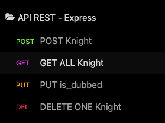

# Express - API (REST) - MySQL

## Introduction

Nous allons faire un petit tp pour appréhender le trio

-   [Express](https://expressjs.com/)
-   [API REST](https://www.redhat.com/en/topics/api/what-is-a-rest-api)
-   [MySQL](https://www.mysql.com/fr/)
    -   Avec [MySQL2](https://www.npmjs.com/package/mysql2)

## Création du projet

Nous allons faire le plus petit projet possible pour appréhender notre trio !

J'ai un fichier `.env` qui ne sera pas commité (bien sûr c'est privé ça ! En revanche, je créer un fichier `.env.example` qui sera commité et qui servira de modèle pour les autres).

```txt
.
├── README.md
├── _docs
│   └── request.png
├── package-lock.json
├── package.json
├── server.js
└── src
    ├── config
    │   └── database.js
    └── index.js

3 directories, 7 files
```

## API REST



| Method | URL  | Description       |
| ------ | ---- | ----------------- |
| POST   | /    | Create one knight |
| GET    | /    | Get all user      |
| PUT    | /:id | Update one user   |
| DELETE | /:id | Delete one user   |
